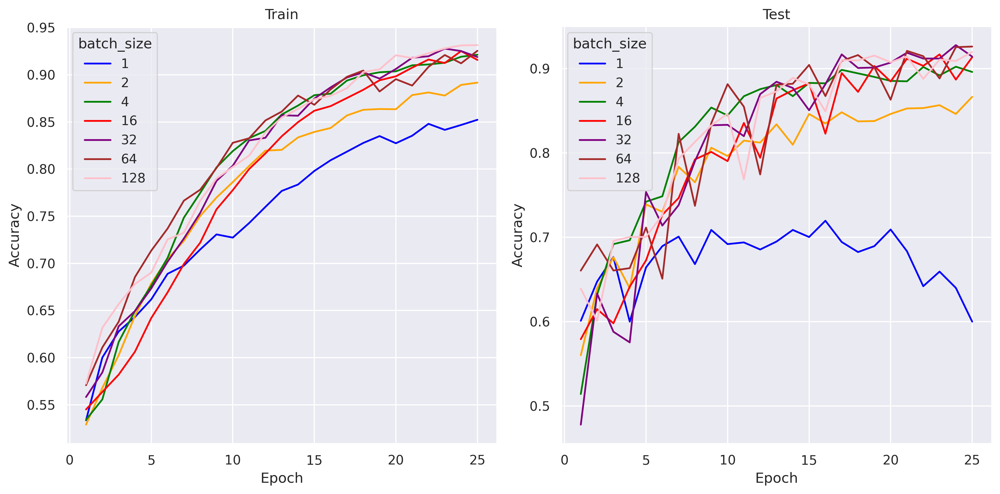
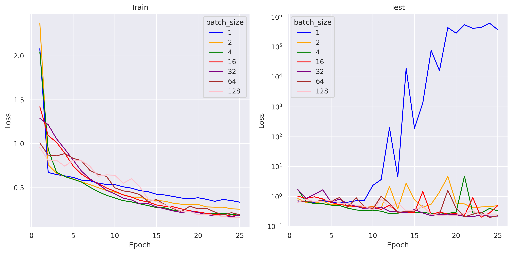
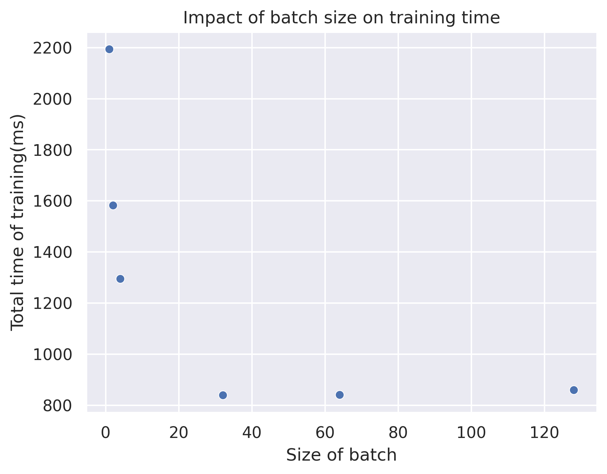

# CatAndDogClassifier
A simple implementation of a cat and dog classifier based on a neural network

The model was trained on a dataset of 4,005 dog images and 4,000 cat images and tested on 1,012 dog images and 1,011 cat images.


# Training the Model
You can train the model using the `train.py` script.
Run the following command:
```bash
python train.py --trainSet path/to/trainset --testSet path/to/testset
```

# Testing the model
To evaluate the model, use the `test.py` script.
Run the following command:
```bash
python test.py --model path/to/model --dataset path/to/dataset
```

# Results of trainig  
The model was trained with various batch sizes. Below are the plots showing the results:

-**Accuracy**

-**Loss function**

-**Total time of training**



# Making Predictions 
You can use the trained model to predict the class of a single image using the `predict.py` script.
Run the following command:
```bash
python predict.py --model path/to/model --image path/to/image
```


